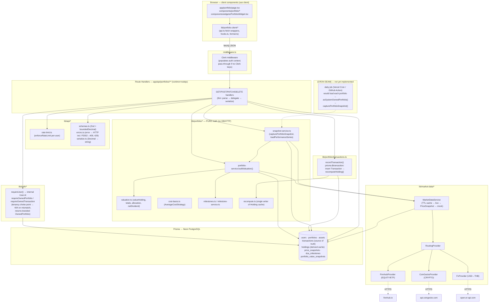

# Portfolio Module Architecture

## Layered data flow

## Request lifecycles

### Write (record a buy/sell/dividend/fee)

1. UI form → `POST /api/portfolios/[id]/transactions`.
2. Handler: `requireUser()` → `enforceRateLimit(userId, "write")` → `requireOwnedPortfolio()` (404 if not owned) → Zod-validate body.
3. Resolve the FX snapshot: use `fxRateUsdThb` from the body if supplied, else fetch the **current live rate now** — this becomes the transaction's immutable `fxRateUsdThb`.
4. `recordTransaction()` opens **one `prisma.$transaction`**:
   - upsert the shared `Asset` by `(symbol, assetType)`,
   - insert the `Transaction`,
   - `recomputeHolding()` replays the asset's whole ledger through the cost-basis strategy and upserts the `Holding`. An over-sell throws `InsufficientQuantityError` → the whole transaction rolls back.
5. Handler re-prices the affected holding (never throws) and returns the transaction + a fresh `HoldingView` (`201`).

### Read (valuation / allocation / milestones)

1. UI hook (`useValuation`, etc.) → `GET .../valuation`.
2. Handler auth-scopes (valuation also rate-limits `providerRead`), then `buildValuation(ownedPortfolio)`:
   - loads `Holding` rows (+ their `Asset`),
   - `MarketDataService.getFxUsdThb()` for today's FX,
   - for each holding `MarketDataService.getAssetPrice()` (cache → live → newest `PriceSnapshot` → mock; never throws),
   - runs the **pure** valuation engine (`valueHolding`, `computeTotals`, `computeAllocation`) and `aggregateSource()` for the honest `source`.
3. Handler serializes every Decimal to a string and returns the envelope.

### Performance history (snapshot capture → series read)

The performance chart is fed by a **separate persistence lane** from the live valuation reads:

- **Capture (write):** `POST /api/portfolios/[id]/performance` → `capturePortfolioSnapshot(ownedPortfolio)`:
  - runs `buildValuation()` now, rounds totals to `Decimal(20,2)`,
  - **upserts** one `PortfolioValueSnapshot` per `(portfolioId, capturedAt)` where `capturedAt` = start of the UTC day. Idempotent — re-running the same day overwrites that day's row, never duplicates (guaranteed by `@@unique([portfolioId, capturedAt])`).
- **Series (read):** `GET /api/portfolios/[id]/performance` → `loadPerformanceSeries()`:
  - range-scans the composite `(portfolioId, capturedAt)` unique index (the `WHERE` filter and `ORDER BY capturedAt ASC` both ride it — no extra index, no N+1),
  - `toPerformanceSeries()` (a **pure**, unit-tested mapper) turns rows into `{ time: <unix seconds>, value: <string> }` for the TradingView Lightweight Charts widget, plus parallel `costSeries` / `pnlSeries` and an aggregated honest `source`.

**[CRON SEAM]** No scheduler exists in this codebase. The intended production trigger is a once-daily job (e.g. Vercel Cron or a GitHub Action hitting an internal route) that, for each portfolio, loads the row server-side and brands it with `asSystemOwnedPortfolio()` before calling `capturePortfolioSnapshot()`. Until that job exists, history is populated only by the manual `POST` trigger. See `extension-guide.md` for how to wire it, and `valuation-engine.md` for the branded-type contract.

## Key architectural boundaries

| Boundary | Rule | Enforced by |
|---|---|---|
| Thin handlers | Route handlers parse/serialize only; all math is delegated | `app/api/portfolios/**` call into `lib/portfolio/*` |
| Pure engine | Valuation/cost-basis/milestones/series mapping has no DB or network → unit-testable | `lib/portfolio/valuation.ts`, `cost-basis.ts`, `milestones.ts`, `snapshot-service.ts` (mappers) |
| Source of truth vs. cache | `Transaction` is authoritative; `Holding` is derived and rebuilt on every write | `recompute.ts` is the *single* writer, run in the same `$transaction` |
| Provider independence | Business code depends on the `MarketDataProvider`/`MarketDataService` interface, never a concrete API | `lib/market-data/index.ts` re-exports; callers import from there |
| Tenant isolation | Every scoped query passes through a helper that *always* takes `userId`; compute helpers accept only the branded `OwnedPortfolio` | `lib/auth/tenancy.ts` |
| Money on the wire | Decimals serialized to strings at the boundary; UI never does money math | `lib/api/serialize.ts`, `lib/portfolio/money.ts` `toStr` |

## Runtime notes

- Handlers set `runtime = "nodejs"` — the standard Prisma client cannot run on Edge.
- The Prisma client is a `globalThis`-cached singleton (`lib/db.ts`) to survive dev hot-reload without exhausting the connection pool.
- `MarketDataService` keeps a **module-scoped in-memory cache** (price TTL 60s, FX TTL 1h) that survives across requests in a warm Node runtime, shielding the external providers from the dashboard poll cadence.
- The rate limiter also keeps counters in module memory (see `security-notes.md` for the serverless caveat).
